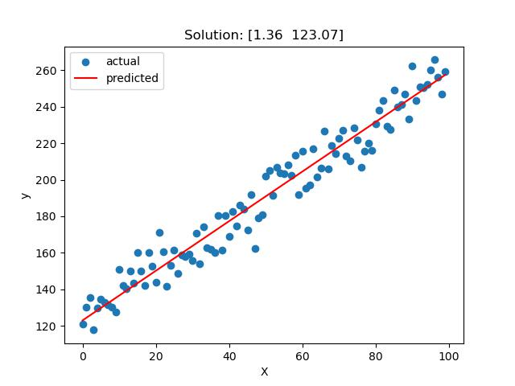

## Files

This repository contains the following files:

- `linear_regression.py`: This file contains the implementation of the Linear Regression model.
- `natural_selector.py`: This file contains the implementation of the Natural Selector for the Genetic Algorithm.
- `main.py`: This file contains the pipeline function for running the code.

To train the Linear Regression model, run the following command:

```zsh
    python main.py
```


This will run the pipeline function and generate the dataset using the following code:

```python
import numpy as np

X = np.arange(100)
noise = np.random.normal(0, 9, size=(X.shape[0],))
y = 1.323 * X + 123.535 + noise
```

The pipeline function trains the Linear Regression model using Genetic Algorithm and generates a plot of the best-fit line obtained by the Genetic Algorithm.

## Result
The following graph shows the original data points and the best-fit line obtained by the Genetic Algorithm:


## Credits
This project was inspired by the following resources:

- [Genetic Algorithms](https://www.geeksforgeeks.org/genetic-algorithms/) by Geeks for Geeks